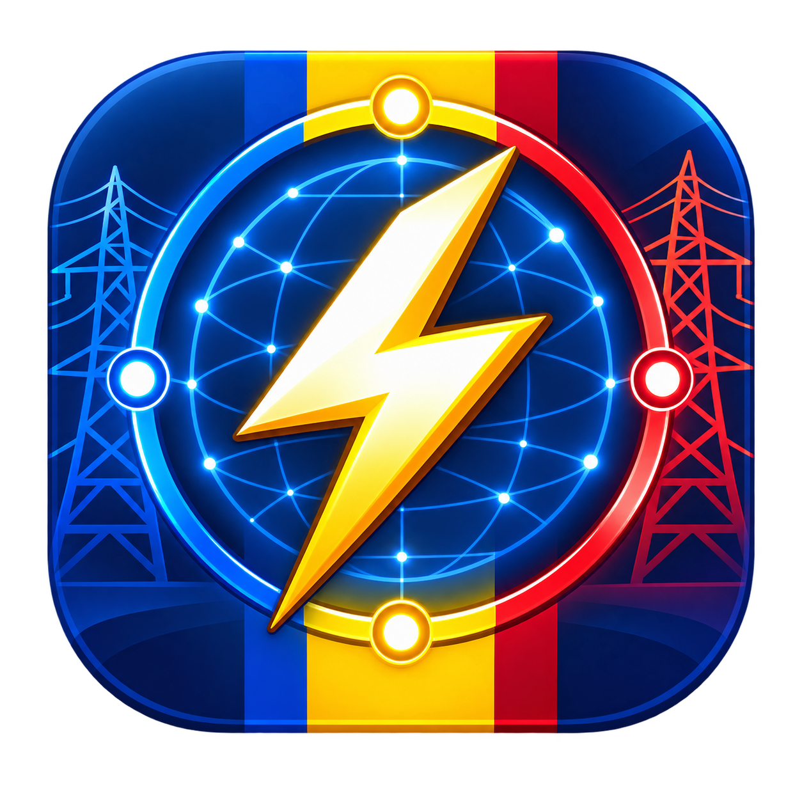

<p align="center">
  
</p>

<p align="center">
  
</p>

<h1 align="center">PZU OPCOM pentru Home Assistant</h1>

<p align="center">
  Prețurile oficiale din Piața pentru Ziua Următoare, direct în Home Assistant.
</p>

<p align="center">
  
  
  
</p>

Integrarea citește exportul CSV oficial OPCOM pentru PZU, convertește automat prețurile din lei/MWh în **RON/kWh** și creează un device unic **PZU OPCOM**, împreună cu senzorii necesari pentru monitorizare și strategia bateriei.

## Funcționalități

- configurare completă din interfața Home Assistant, fără credențiale;
- un device unic care grupează toate entitățile PZU OPCOM;
- preț curent, prețul orei următoare și statistici zilnice;
- strategie de încărcare, așteptare sau vânzare/descărcare a bateriei;
- actualizare automată la fiecare 30 de minute;
- păstrarea ultimei citiri valide în cazul erorilor temporare de rețea;
- instalare prin HACS sau manual.

## Instalare prin HACS

1. Deschide **HACS → Integrations**.
2. Din meniul din dreapta sus alege **Custom repositories**.
3. Adaugă:
   `https://github.com/andrexyx/pzu-opcom-home-assistant`
4. Selectează categoria **Integration** și instalează **PZU OPCOM**.
5. Repornește Home Assistant.
6. Mergi la **Settings → Devices & services → Add Integration**.
7. Caută **PZU OPCOM** și confirmă configurarea.

## Instalare manuală

1. Copiază folderul `custom_components/pzu_opcom` în `/config/custom_components/`.
2. Repornește Home Assistant.
3. Mergi la **Settings → Devices & services → Add Integration**.
4. Caută **PZU OPCOM** și confirmă configurarea.

> [!IMPORTANT]
> Configurarea din interfața Home Assistant este obligatorie. Dacă ai folosit o versiune veche și ai `pzu_opcom:` în `configuration.yaml`, elimină acea secțiune înainte de repornire.

## Entități

| Entitate | Rol |
|---|---|
| `sensor.pzu_pret_curent` | Prețul intervalului curent |
| `sensor.pzu_pret_ora_urmatoare` | Prețul următorului interval |
| `sensor.pzu_pret_minim_azi` | Prețul minim al zilei |
| `sensor.pzu_pret_maxim_azi` | Prețul maxim al zilei |
| `sensor.pzu_pret_mediu_azi` | Prețul mediu al zilei |
| `sensor.pzu_strategie_baterie` | Recomandarea pentru baterie |

Senzorul de strategie expune și atributele `prag_incarcare` și `prag_vanzare`. Toate entitățile sunt asociate device-ului **PZU OPCOM**.

Valorile numerice și pragurile sunt publicate cu maximum 4 zecimale. Versiunea 1.1.1 migrează automat ID-urile generate anterior cu prefix duplicat (`sensor.pzu_opcom_pzu_*`) la ID-urile stabile `sensor.pzu_*` din tabelul de mai sus.

## Card Lovelace

```yaml
type: vertical-stack
cards:
  - type: tile
    entity: sensor.pzu_strategie_baterie
    name: Strategie baterie
    icon: mdi:battery-sync
    color: blue
    state_content:
      - state
  - type: grid
    columns: 2
    square: false
    cards:
      - type: tile
        entity: sensor.pzu_pret_curent
        name: Preț curent
        icon: mdi:cash-clock
        color: amber
      - type: tile
        entity: sensor.pzu_pret_ora_urmatoare
        name: Ora următoare
        icon: mdi:clock-outline
        color: orange
  - type: entities
    title: Statistici și praguri PZU
    show_header_toggle: false
    entities:
      - sensor.pzu_pret_minim_azi
      - sensor.pzu_pret_maxim_azi
      - sensor.pzu_pret_mediu_azi
      - type: attribute
        entity: sensor.pzu_strategie_baterie
        attribute: prag_incarcare
        name: Prag încărcare
      - type: attribute
        entity: sensor.pzu_strategie_baterie
        attribute: prag_vanzare
        name: Prag vânzare
```

## Date și disponibilitate

Datele sunt actualizate în fusul orar `Europe/Bucharest`. Erorile de rețea nu sunt transformate în prețul zero: integrarea păstrează ultima citire validă, iar entitățile devin indisponibile numai dacă nu există deloc date valide.

Sursa datelor: [OPCOM – Rezultate PZU RO](https://www.opcom.ro/grafice-ip-raportPIP-si-volumTranzactionat/ro).

## Actualizare

Actualizările se instalează din **HACS → PZU OPCOM → Update**. După actualizare, repornește Home Assistant.

## Autori și contribuții

- [@andrexyx](https://github.com/andrexyx) — autor și maintainer
- [@adelinchristian](https://github.com/adelinchristian) — colaborator; configurare GUI și asocierea entităților cu device-ul

Mulțumiri tuturor celor care testează integrarea și contribuie cu feedback.

## Licență

Distribuit sub licența [MIT](LICENSE).
